---
layout: post
title: Profiling .NET application with AMD uProf
---
 # Download and Install

 [https://developer.amd.com/amd-uprof/#download](https://developer.amd.com/amd-uprof/#download)

 Windows `AMDuProf-3.4.449.exe`

 

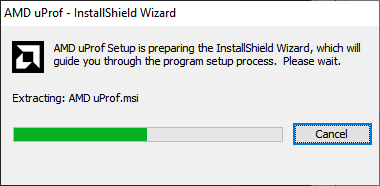

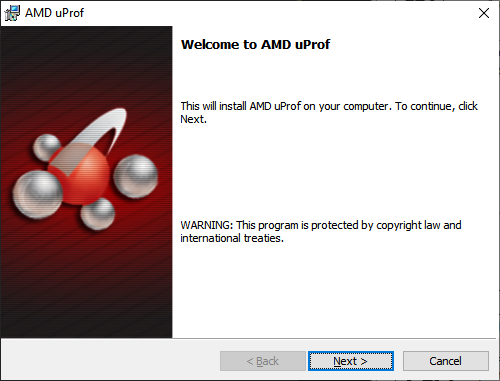

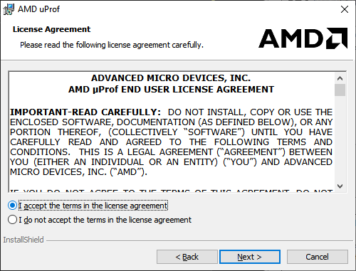

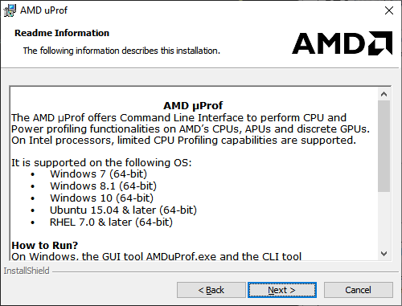

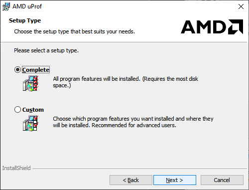

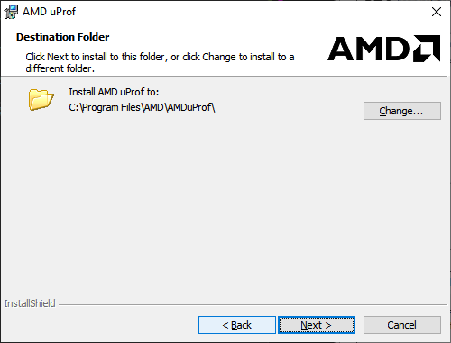

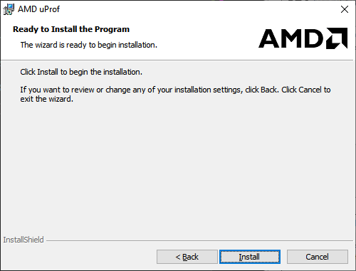

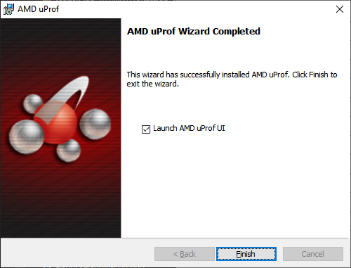

# App
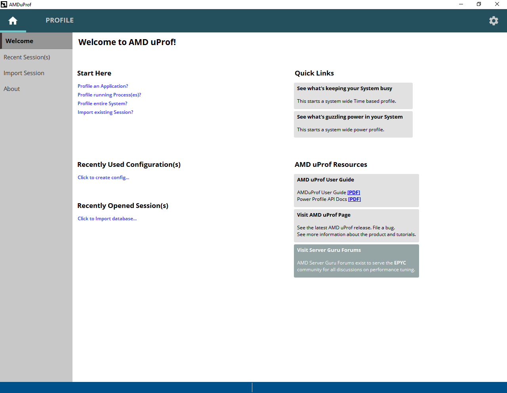

**Profile running Process(es)?**

## TBP
NOTE: Config Name defines what will be measured.
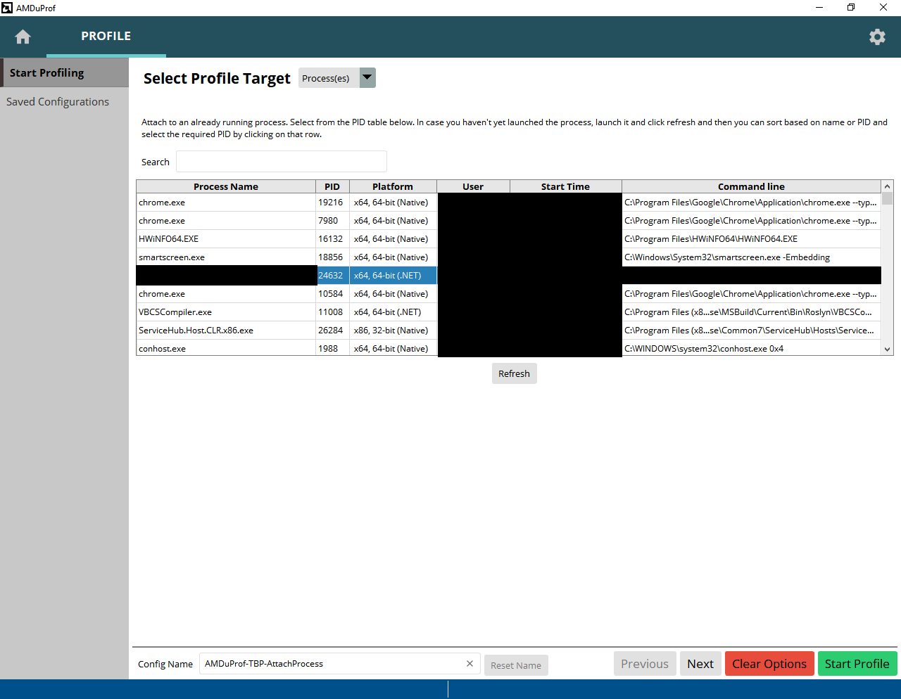

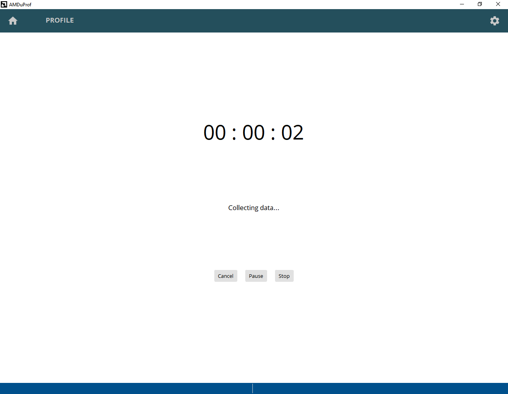

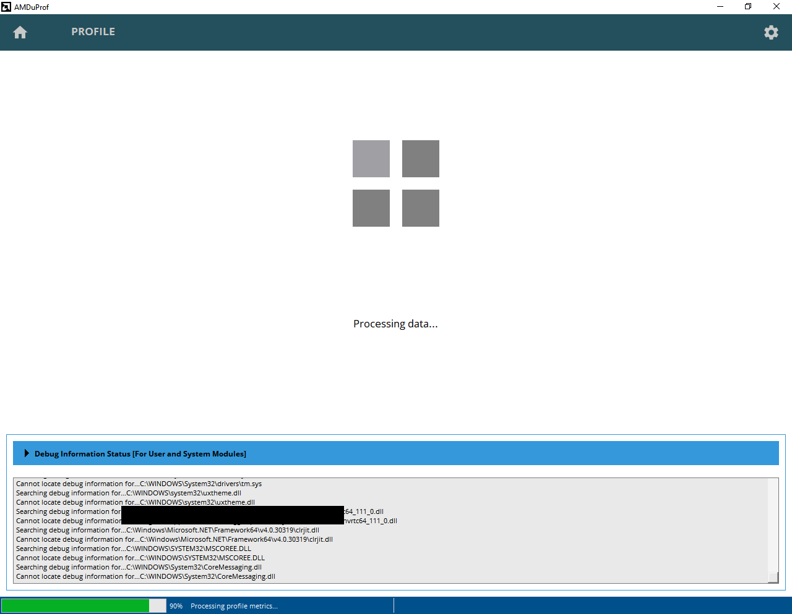

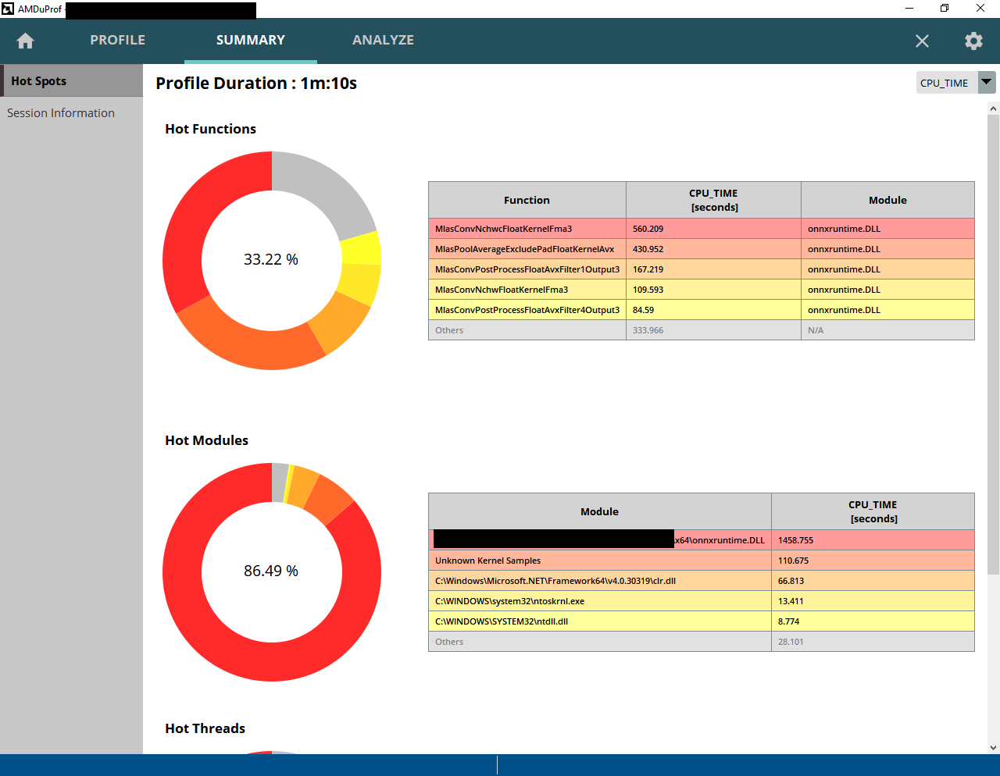

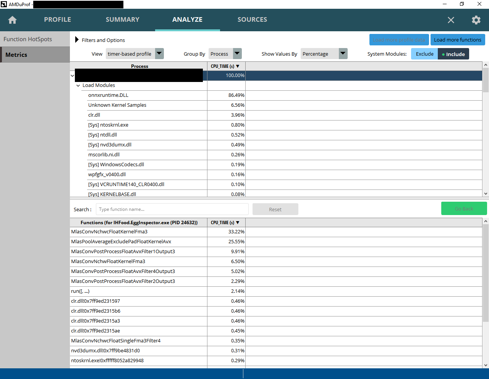

## Customize

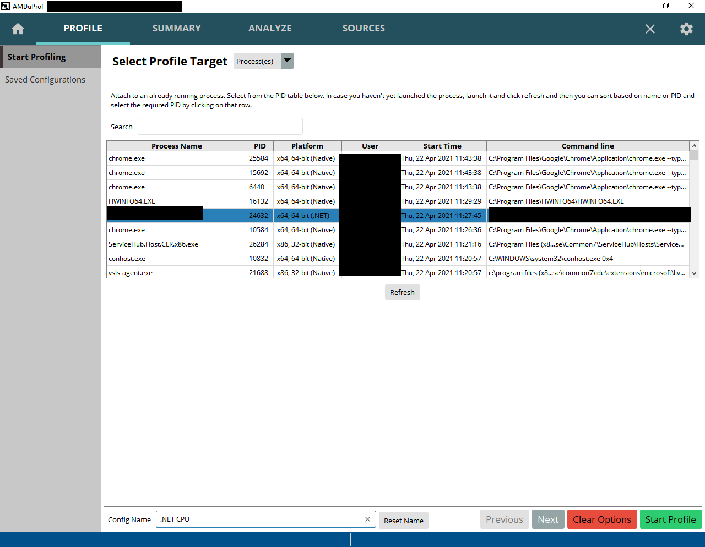

Can't use `.` in config name since used for file name.
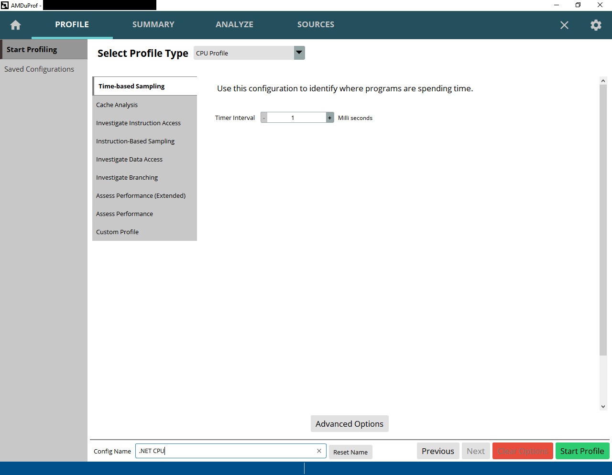

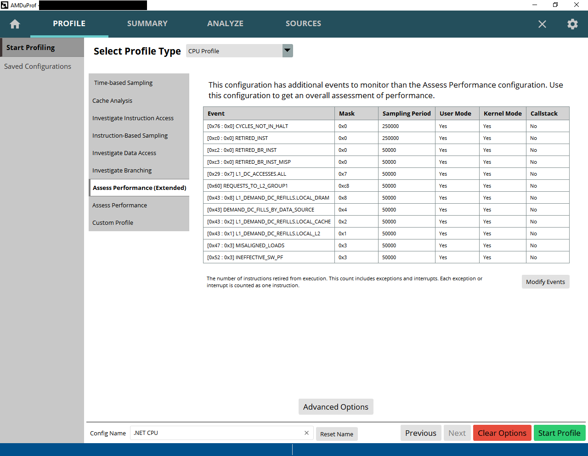