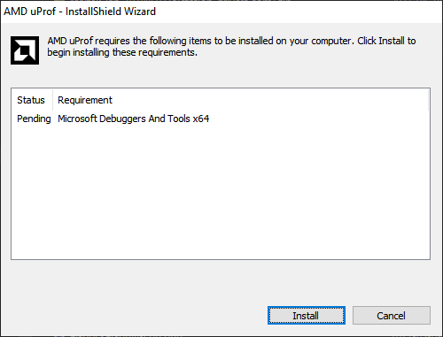
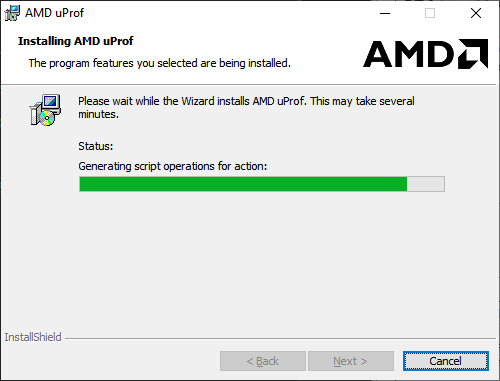

 # Download and Install

 [https://developer.amd.com/amd-uprof/#download](https://developer.amd.com/amd-uprof/#download)

 Windows `AMDuProf-3.4.449.exe`

 

# App

**Profile running Process(es)?**

## TBP
NOTE: Config Name defines what will be measured.

## Customize

Can't use `.` in config name since used for file name.

